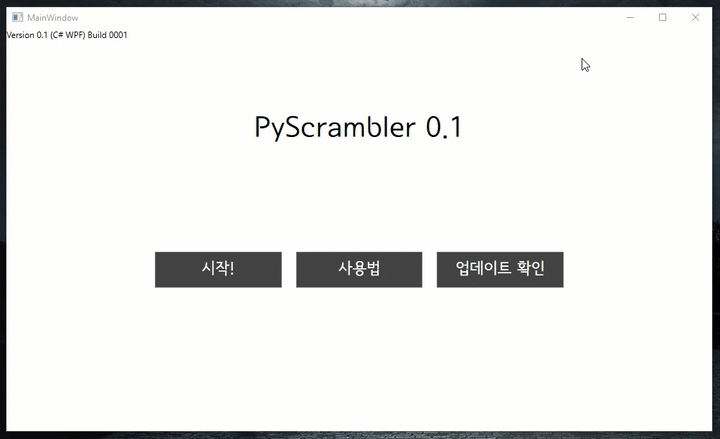
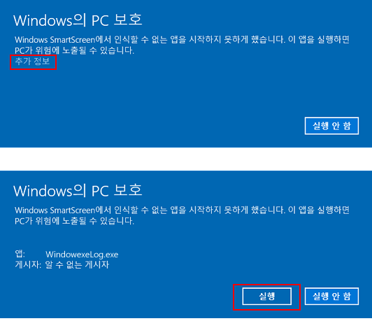
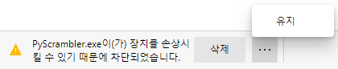

# PyScrambler



PyScrambler는 영어 문장의 각 단어를 랜덤으로 섞어 맞추는 프로그램으로, 학교 내신 본문이나 모의고사 본문을 이용한 단어 배열 문제를 효과적으로 대비할 수 있습니다.

## 0. 다운로드

[Version 0.1 (C# WPF) Build 0001](https://github.com/obbcth/PyScrambler/releases)

## 1. 사용법

본문을 아래의 **3. 본문 파일 만들기** 파트를 참고하여 제작합니다.

**시작!** 버튼을 누르면 본문 파일을 선택할 수 있습니다. 만들었던 txt 파일을 선택합니다.

선택한 본문파일로 학습을 시작합니다. 섞은 단어를 이용하여 문제를 맞추면 됩니다.

아래의 **2. 특수 기능** 파트를 참고하시기 바랍니다.

## 2. 특수 기능

**띄어쓰기, 대소문자, 숫자, 특수문자**는 전부 구별하지 않습니다.

h : 힌트 (정답) 을 출력합니다. 자동으로 페이지가 넘어가진 않습니다.

p : 문제를 패스 (스킵) 합니다.

r : 단어 배열을 리셋합니다.

b : 이전 문제로 돌아갑니다.

## 3. 본문 파일 만들기

본문 파일은 ```[``` 와 ```]``` 로 **시작**과 **끝**을 구분합니다.

하나의 문장은 **Enter키로 구분 (개행문자의 개수로 구분)** 하며, 예시는 다음과 같습니다.

본문 파일.txt :

> Not all people have a strong bout of typhoid fever; some people can have such a weak case that they only experience flu-like symptoms. Thus, [Mallon could have had typhoid fever but never known it].

출력 결과 :
```
 Not all people have a strong bout of typhoid fever; some people can have such a weak case that they only experience flu-like symptoms. Thus, ________________________.
 단어: have / could / typhoid / but / it / mallon / had / fever / it / known
 
 (정답 입력 폼)
```

하나의 문장에는 한 문제가 출력되며, 만약 하나의 문장에 ```[``` 와 ```]``` 이 두 번 이상 사용된 경우, 첫 번째 사용된 기호로 시작과 끝을 구분합니다. 나머지는 문장으로 처리합니다.

## 4. 추가 내용

본문파일을 행을 나누지 않고 너무 많은 양을 입력하거나, 정답 입력 폼에 너무 많은 양을 입력할 시 로딩에 시간이 너무 오래걸려 프로그램이 작동을 중지할 수 있습니다.

프로그램이 오류가 날 시, [Issues](https://github.com/obbcth/PyScrambler/issues) 에서 관련 사항을 기재하면 됩니다.

실행 시, 다음과 같은 오류는 더 보기, 추가 사항 등을 입력하면 실행이 가능합니다. 예시는 아래와 같습니다.



